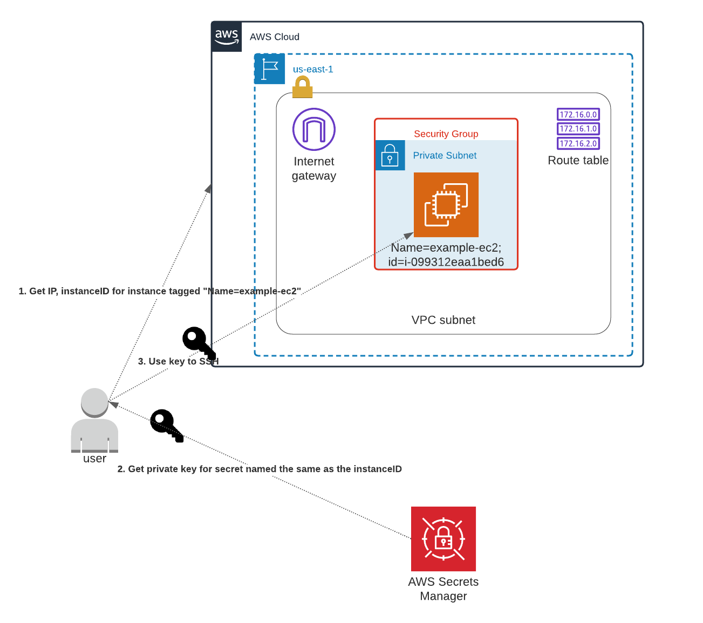

# What we're doing


# Requirements

## For Docker Execution (recommended)
* Docker
* Make system for your OS (to leverage the Makefile)

## For Local Execution
* Terraform 0.15.x should work. I recommend installing tfswitch to manage TF versions.
* AWS CLI installed
* jq installed

# Docker Usage
* Execute `make bootstrap`. This builds the infrastructure.
* Execute `make login`, using the server name that you entered in the previous step.
* Execute `make teardown`. This destroys the infrastructure.

# Local System Usage Automatically
* Execute `./bootstrap.sh` to build infra.
* Execute `./login.sh` to login to the server just created.
* Execute `./teardown.sh` to tear everything down.

# Manual Usage Locally
NOTE: The below are details that happen if not using above scripts.
* Generate new keypair in current directory:
```
ssh-keygen -f ./ec2 -b 2048 -t rsa -q -N ""
```
NOTE: Private key will be in `ec2`, and public key will be in `ec2.pub`. We'll use this later.

* Refresh AWS login info:
```
rm  -rf ~/.aws/credentials
aws configure
```
* Create a random string (for globally unique infra):
```
openssl rand -hex 10
```
* Create .env file:
```
#!/bin/bash
export TF_VAR_REGION="us-east-1"
export TF_VAR_STATE_BUCKET_NAME="tfstate-<your random string>-sshpoc" 
export TF_VAR_STATE_BUCKET_KEY="tfstate"
export TF_VAR_PROJECT="whatever"
```
* Create S3 bucket to hold remote state:
```
aws s3api  create-bucket --bucket $TF_VAR_STATE_BUCKET_NAME --region $TF_VAR_REGION
```
* Init backend state:
```
terraform init --backend-config "bucket=$TF_VAR_STATE_BUCKET_NAME" --backend-config "key=$TF_VAR_STATE_BUCKET_KEY" --backend-config "region=$TF_VAR_REGION"
```
* Terraform plan
```
terraform plan
```
* Terraform apply
```
terraform apply -auto-approve
```
* Test with local key
```
ssh -i ec2 ubuntu@$(terraform output publicIP | tr -d \")
```
NOTE: `tr -d \"` strips quotes from IP address.
* Test with SecretManager in AWS:
```
aws secretsmanager get-secret-value --secret-id $(aws ec2 describe-instances --query "Reservations[*].Instances[*].{InstanceId:InstanceId,PublicIP:PublicIpAddress,Name:Tags[?Key=='Name']|[0].Value,Status:State.Name}" --filters Name=instance-state-name,Values=running | jq -r '.[][].InstanceId') | jq -r '.SecretString' > ec2secret; chmod 700 ec2secret; ssh -i ec2secret ubuntu@$(terraform output publicIP | tr -d \"); rm -f ec2secret
```
* Destroy things:
```
terraform destroy -auto-approve
```